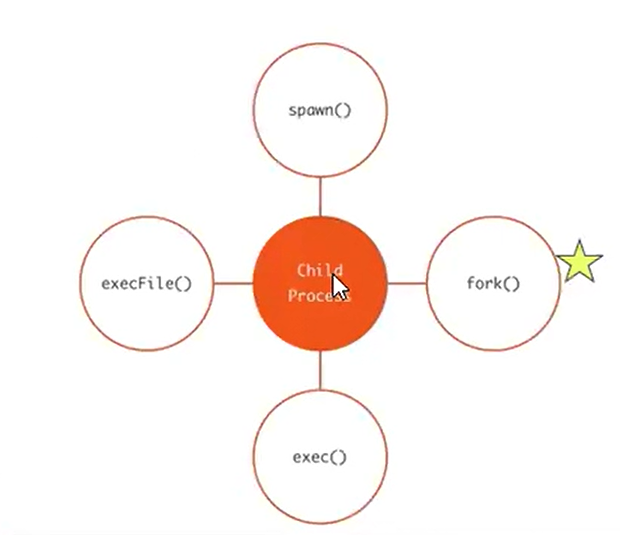

node se ejecuta en un sólo hilo

cuando node se encuentra con una operacion asincronica, la manda a ejecutar y sigue con la pila de tareas que tiene para ejecutar 

en algun momento recibe el evento de que la funcion asincronica finalizó y va a retomar lo que tenia que hacer en esa operacion asincronica 

a veces no es suficiente un sólo hilo. vamos a ver cómo usar todos los hilos de la pc.

el manejo de los procesos hijos es una técnica para aprovechar al maximo su funcionalidad y que la aplicación escale su capacidad de procesar 

un ej bajado a tierra sería: que un empleado, trae a sus hijos a trabajar y el se queda dando las directivas

ejemplos donde el proceso principal pone a trabajar a sus procesos hijos


# child process 
en caso de que lleguen mil solicitudes por segundo, un sólo proceso no se lo va a bancar, entonces ahi hay que empezar a preparar la aplicacion para el crecimiento,

el manejo de los procesos hijos es una técnica para aprovechar y hacer que la app escale

multiplicamos el proceso principal 
tener un jefe/patrón de la obra, que trae obreros a trabajar, y queda a cargo

### como hacer que el proceso principal haga trabajar a sus procesos hijos 

proceso hijo, es un proceso creado por el proceso padre y node 01_process/nos va a permitir crear esos procesos con varias funciones/metodos 


### exec 
https://developer.mozilla.org/es/docs/Web/JavaScript/Reference/Global_Objects/RegExp/exec

child process es una libreria nativa de node, no se instala

la funcion exec lo que haces es abrir la terminal, ejecutar un comando y cerrar la terminal, y manda la respuesta a una funcion callback que está esperando la rta 

como 1° parametro recibe el comando a ejecutar, y como 2° parametro una callback, que recibe 3 argumentos
el 1° de esos argumentos, es 'err', si no se puede ejecutar 


### execFile
#### error Error: spawn EFTYPE
"Este tipo de archivo no se puede ejecutar", busca un ejecutable y encuentra un archivo estatico

### execFile() ejecuta programas compiled o binarios


- https://nodejs.org/api/child_process.html#child_processexecfilefile-args-options-callback
- https://nodejs.org/api/child_process.html

### spawn
la diferenncia con exec, es que la rta me la va a dar en cuotas 

puedo procesar + info, pero lo tengo que atajar como si fueran eventos 


```bash
find / # lista todos los archivos en la pc
find . # lista los archivos en el directorio
```

crea un proceso hijo, y que este haga el trabajo sucio
lo que permite es que el proceso principal no esté bloqueado y pueda estar haciendo otras cosas
lo que permite es usar al máximo la capacidad del hilo


### Recapitulación
- exec --> Crea un proceso aparte, para que ejecute un comando que yo le paso. el proceso hace lo suyo, y cuando termina me manda la data 
- execFile --> hace lo mismo, pero permite leer el comando desde un archivo externo 
! ambos daban error, al querer ejecutar una tarea grande, superaba el peso permitido
- spawn --> para evitar eso, devuelve la info en cuotas

### fork 
es como el spawn, en el sentido de que si quiero crear un proceso hijo, le digo; hace esta acción

### fork vs spawn
fork proporciona un medio de comunicacion para que el proceso padre se comunique con el hijo, y el hijo con el padre. es atraves de eventos

el index bloqueante, no tiene nada que no conozcamos 